# WMS Core Engine - UML Class Diagram

This document describes the main domain objects, services, repositories, and their relationships in the WMS Core Engine.

The diagram focuses on the main business objects and architectural dependencies rather than listing every private method.

```mermaid
classDiagram

    %% =========================
    %% Domain - Products
    %% =========================

    class BaseProduct {
        +sku
        +name
        +barcode
        +category
        +base_price
    }

    class VariantProduct {
        +attributes
        +price_modifier
        +parent_product
    }

    class BundleProduct {
        +base_price
        +components
    }

    class BundleComponent {
        +product
        +required_quantity
    }

    class PerishableProduct {
        +expiry_required
    }

    class SerializedProduct {
        +serial_tracking
    }

    BaseProduct <|-- VariantProduct
    BaseProduct <|-- BundleProduct
    BaseProduct <|-- PerishableProduct
    BaseProduct <|-- SerializedProduct

    BundleProduct "1" *-- "1..*" BundleComponent
    BundleComponent "*" --> "1" BaseProduct

    VariantProduct "*" --> "0..1" BaseProduct : parent

    %% =========================
    %% Domain - Inventory
    %% =========================

    class Warehouse {
        +warehouse_id
        +name
        +location
        +warehouse_type
    }

    class Inventory {
        +warehouse
        +batches
    }

    class Batch {
        +batch_id
        +product
        +quantity
        +entry_date
        +unit_cost
        +status
    }

    class Reservation {
        +reservation_id
        +order_id
        +sku
        +quantity
    }

    Warehouse "1" --> "1" Inventory
    Inventory "1" *-- "*" Batch
    Batch "*" --> "1" BaseProduct
    Inventory "1" o-- "*" Reservation

    %% =========================
    %% Domain - Orders
    %% =========================

    class Order {
        +order_id
        +customer_id
        +status
        +items
        +total_amount
    }

    class OrderItem {
        +item_id
        +sku
        +quantity
        +product_name
        +unit_price
        +discount
    }

    Order "1" *-- "1..*" OrderItem

    Order "1" --> "*" Reservation

    %% =========================
    %% Domain - Returns
    %% =========================

    class ReturnRequest {
        +return_id
        +order_id
        +reason
        +status
        +items
        +qc_result
    }

    class ReturnItem {
        +sku
        +quantity
        +serial_numbers
    }

    class ReturnReceipt {
        +receipt_id
        +return_id
        +sku
        +quantity
        +location
        +status
        +received_at
    }

    ReturnRequest "1" *-- "1..*" ReturnItem
    ReturnRequest "*" --> "1" Order : order_id
    ReturnRequest "1" --> "0..*" ReturnReceipt

    %% =========================
    %% Services
    %% =========================

    class OrderService {
        +create_order()
        +reserve_order()
        +mark_as_paid()
        +ship_order()
        +deliver_order()
        +cancel_order()
    }

    class InventoryService {
        +receive()
        +reserve()
        +release()
        +ship()
        +transfer()
    }

    class PricingService {
        +price_order()
    }

    class SalesRuleEngine {
        +validate()
    }

    class QCService {
        +record_result()
    }

    class ReturnReceivingService {
        +receive()
    }

    class RMAService {
        +process()
    }

    class RefundService {
        +refund()
    }

    class ReturnEligibilityService {
        +check()
    }

    class ReturnWindowPolicy {
        +validate()
    }

    class StockTransferService {
        +create()
        +dispatch()
        +receive()
    }

    %% =========================
    %% State Machines
    %% =========================

    class OrderStateMachine {
        +transition()
    }

    class ReturnStateMachine {
        +transition()
    }

    %% =========================
    %% Service Dependencies
    %% =========================

    OrderService ..> Order
    OrderService ..> Inventory
    OrderService ..> PricingService
    OrderService ..> SalesRuleEngine
    OrderService ..> OrderStateMachine

    InventoryService ..> Inventory
    InventoryService ..> Batch
    InventoryService ..> Reservation

    PricingService ..> Order
    PricingService ..> OrderItem
    PricingService ..> BaseProduct

    SalesRuleEngine ..> Order

    ReturnReceivingService ..> ReturnRequest
    ReturnReceivingService ..> ReturnReceipt

    QCService ..> ReturnRequest

    RMAService ..> ReturnRequest
    RMAService ..> ReturnReceipt
    RMAService ..> Inventory
    RMAService ..> Batch

    RefundService ..> ReturnRequest
    RefundService ..> Order
    RefundService ..> OrderItem

    ReturnEligibilityService ..> ReturnRequest
    ReturnWindowPolicy ..> ReturnRequest

    StockTransferService ..> Inventory

    OrderStateMachine ..> Order
    ReturnStateMachine ..> ReturnRequest

    %% =========================
    %% Repositories
    %% =========================

    class ProductRepository {
        +save()
        +get()
        +list()
    }

    class OrderRepository {
        +save()
        +get()
        +list()
    }

    class PaymentTransactionRepository {
        +save()
        +get()
    }

    class ShipmentRepository {
        +save()
        +get()
    }

    class FinancialTransactionRepository {
        +save()
        +get()
    }

    OrderService ..> ProductRepository
    OrderService ..> OrderRepository
    OrderService ..> PaymentTransactionRepository
    OrderService ..> ShipmentRepository

    RMAService ..> ProductRepository
    RefundService ..> FinancialTransactionRepository

    %% =========================
    %% Architectural Boundaries
    %% =========================

    class DomainLayer {
        <<layer>>
    }

    class ServiceLayer {
        <<layer>>
    }

    class RepositoryLayer {
        <<layer>>
    }

    ServiceLayer ..> DomainLayer : uses
    RepositoryLayer ..> DomainLayer : implements access to

```



## Architectural Rules

The intended dependency direction is:

```text
Service Layer
       |
       v
Domain Layer

Repository Layer
       |
       v
Domain Layer
```

The important rule is that the **Domain layer must not depend on the Service or Repository layers**.

Services use domain objects to execute business operations.

Repository implementations use domain objects for persistence while keeping data-access responsibilities outside the Domain layer.

Business logic should remain inside the Domain and Service layers rather than inside `main.py`.

The `main.py` file should only coordinate the demo scenario and call the existing services.

## Main Relationships

### Product

`BaseProduct` is the main product abstraction.

Specialized products extend it:

```text
BaseProduct
    |
    +-- VariantProduct
    +-- BundleProduct
    +-- PerishableProduct
    +-- SerializedProduct
```

A `BundleProduct` contains one or more `BundleComponent` objects.

Each `BundleComponent` references a product and specifies the required quantity.

A `VariantProduct` can reference a parent product.

### Inventory

A `Warehouse` has an `Inventory`.

An `Inventory` contains `Batch` objects.

Each `Batch` references a product.

```text
Warehouse
    |
    v
Inventory
    |
    +-- Batch
    +-- Batch
    +-- Batch
```

Inventory also works with reservations created during order processing.

### Order

An `Order` contains one or more `OrderItem` objects.

Order items store the product SKU rather than creating a direct object dependency on `BaseProduct`.

The order is processed by `OrderService`.

```text
Order
  |
  +-- OrderItem
  |
  +-- Reservation
```

### Return

A `ReturnRequest` belongs to an order through `order_id`.

A return contains one or more `ReturnItem` objects.

The physical receiving process creates a `ReturnReceipt`.

```text
Order
  |
  v
ReturnRequest
  |
  +-- ReturnItem
  |
  +-- ReturnReceipt
```

Return items also identify products through their SKU.

### Reverse Logistics

The return process is coordinated by multiple services:

```text
ReturnRequest
      |
      v
ReturnReceivingService
      |
      v
ReturnReceipt
      |
      v
QCService
      |
      v
RMAService
      |
      +------> Sellable Inventory
      |
      +------> Quarantine
      |
      v
RefundService
```

This keeps each business responsibility separated instead of placing the entire return process inside one class.

## Layer Responsibilities

### Domain Layer

Contains the core business objects, enums, exceptions, and state machines.

Examples:

```text
Product
Warehouse
Inventory
Batch
Order
OrderItem
ReturnRequest
ReturnItem
ReturnReceipt
```

### Service Layer

Coordinates business operations using domain objects.

Examples:

```text
OrderService
InventoryService
PricingService
RMAService
QCService
RefundService
ReturnReceivingService
StockTransferService
```

### Repository Layer

Handles persistence and data access.

Examples:

```text
ProductRepository
OrderRepository
PaymentTransactionRepository
ShipmentRepository
FinancialTransactionRepository
```

The Repository layer should not move business rules into persistence code.

## Clean Architecture Summary

The main architectural principle is separation of responsibilities:

```text
              +----------------------+
              |      main.py         |
              |   Demo / Entry Point |
              +----------+-----------+
                         |
                         v
              +----------------------+
              |    Service Layer     |
              | Business Operations  |
              +----------+-----------+
                         |
                         v
              +----------------------+
              |     Domain Layer     |
              | Models / Rules / FSM |
              +----------+-----------+
                         ^
                         |
              +----------+-----------+
              |   Repository Layer   |
              |    Data Access       |
              +----------------------+
```

The goal is to keep the core business model independent from UI, demo code, and storage implementation.